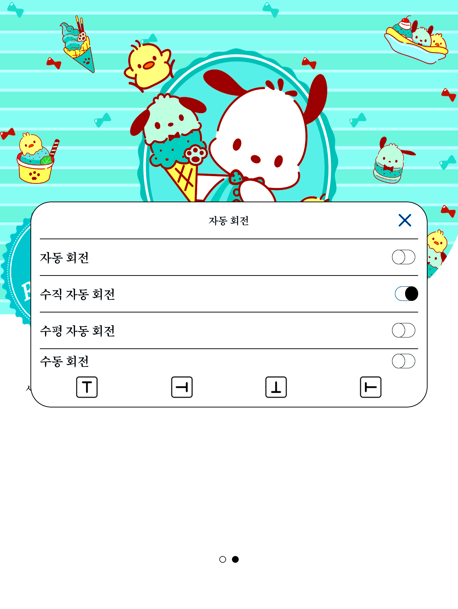
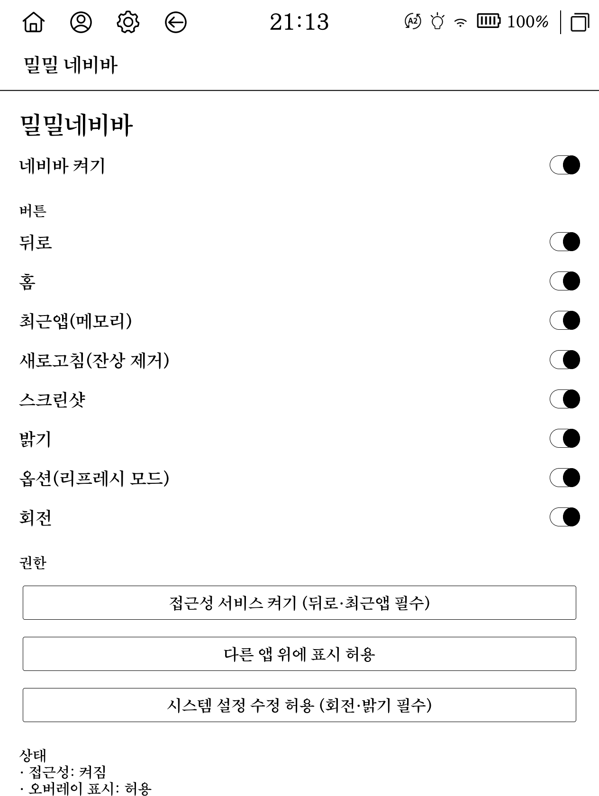

# 밀밀 네비바 (Milmil NavBar)

크레마 팔레트(YES24 e-ink 리더)를 위한 하단 네비게이션 바입니다. 루트 없이 접근성 오버레이로 동작합니다.

크레마 팔레트는 상단바만 있고 하단 네비게이션이 없어서 뒤로가기, 홈, 최근앱을 엣지 제스처에만 의존해야 합니다. 이 앱은 화면 하단에서 스와이프업하면 나타나는 자동 숨김 바로 그 기능들을 제공합니다.


## 기능

하단에서 위로 스와이프하면 바가 나타나고, 약 4초 뒤 자동으로 숨겨집니다. 맨 왼쪽 아래화살표를 누르면 즉시 숨길 수 있습니다.

각 버튼은 크레마 내부 기능을 그대로 호출합니다.

| 버튼 | 동작 | 열리는 것 / 구현 |
|:---:|:---|:---|
| 뒤로 | 뒤로가기 | 접근성 `GLOBAL_ACTION_BACK` |
| 홈 | 홈으로 | 접근성 `GLOBAL_ACTION_HOME` |
| 최근앱 | 크레마 최근앱 / 메모리 관리 화면 | `com.haoqing.action.TOGGLE_RECENTS` 브로드캐스트 |
| 새로고침 | e-ink 잔상 제거(전체화면 흑백 플래시) | 자체 오버레이 |
| 옵션 | 리프레시 모드(리갈 / HD / A2) 선택 팝업 | `com.haoqing.action.start.RefreshSettings` 브로드캐스트 |
| 회전 | 크레마 정식 회전 다이얼로그(자동 / 수직 / 수평 / 수동 4방향) | `com.haoqing.action.SHOW_AUTOMATICROTATION_DIALOG` |
| 스크린샷 *(기본 off)* | 시스템 스크린샷(바를 숨긴 뒤 촬영) | 접근성 `GLOBAL_ACTION_TAKE_SCREENSHOT` |
| 밝기 *(기본 off)* | 화면 밝기 단계 순환 | `WRITE_SETTINGS` |

예를 들어 회전 버튼을 누르면 크레마 자체 회전 다이얼로그가 그대로 열립니다.



## 설치

[릴리스](../../releases/latest)에서 `milmil-navbar-0.1.1.apk`를 받아 설치합니다.

```bash
# 크레마는 adb 설치를 기기 베리파이어가 막을 수 있어, 최초 1회만:
adb shell settings put global verifier_verify_adb_installs 0

adb install milmil-navbar-0.1.1.apk
```

## 권한 설정

설치 후 앱을 열면 하단 "권한" 영역에 각 항목을 여는 버튼이 있습니다. 아래 순서로 켜세요.

1. **접근성 서비스 켜기** : 뒤로, 홈, 최근앱, 스크린샷 동작에 필요합니다. 접근성 설정에서 "밀밀 네비바"를 켭니다.
2. **다른 앱 위에 표시 허용** : 바 오버레이 표시에 필요합니다.
3. **시스템 설정 수정 허용** : 밝기 조절에 필요합니다(밝기 버튼을 쓸 때만).

### adb로 권한 부여 (더 빠름)

adb를 쓰려면 먼저 기기에서 USB 디버깅을 켜세요. (설정 → 기기 정보에서 빌드번호를 7번 눌러 개발자 옵션을 켠 뒤, 개발자 옵션에서 USB 디버깅 활성화)

```bash
# 오버레이 표시 + 시스템 설정 수정
adb shell appops set com.milmil.navbar SYSTEM_ALERT_WINDOW allow
adb shell appops set com.milmil.navbar WRITE_SETTINGS allow
```

접근성(뒤로, 스크린샷용)은 두 방법 중 하나:

```bash
# 방법 A: "제한된 설정" 차단만 해제한 뒤, 설정 → 접근성에서 "밀밀 네비바"를 직접 켜기
#         (사이드로드 앱은 접근성 토글이 제한되므로 이 차단을 풀어야 켤 수 있음)
adb shell appops set com.milmil.navbar ACCESS_RESTRICTED_SETTINGS allow

# 방법 B: adb로 바로 켜기 (기존 접근성 목록을 덮어쓰니 주의)
adb shell settings put secure enabled_accessibility_services com.milmil.navbar/com.milmil.navbar.NavAccessibilityService
adb shell settings put secure accessibility_enabled 1
```

## 사용법

- **바 열기** : 화면 하단 가장자리에서 위로 살짝 스와이프합니다. 탭만 해도 열립니다.
- **바 닫기** : 약 4초 후 자동으로 숨겨지거나, 맨 왼쪽 아래화살표 버튼을 누릅니다.
- **버튼 표시 설정** : 앱을 열면 버튼별로 켜고 끌 수 있습니다. 뒤로, 스크린샷, 밝기는 기본이 꺼짐입니다. 그중 뒤로와 스크린샷은 접근성 서비스가 필요해서, 접근성을 켜야 선택할 수 있습니다(접근성이 없으면 해당 토글은 비활성). 뒤로가기는 접근성 없이 크레마 코너 제스처로도 됩니다.



## 알려진 제약

- **콘텐츠 세이프에어리어(인셋)를 예약하지 못합니다.** 크레마 펌웨어는 `config_showNavigationBar=false`로 네비바 인셋 자체를 막아두었고, 이를 켜려면 루트가 필요합니다. 따라서 바는 앱 콘텐츠 위에 겹쳐 뜹니다(자동 숨김으로 완화). 참고로 크레마는 native로도 이 인셋을 제공하지 않습니다.
- **앱 업데이트 후 접근성 재바인딩이 필요할 수 있습니다.** 접근성을 껐다 켜면 복구되고, 부팅 시에는 자동으로 복구됩니다.
- 최근앱, 옵션, 회전은 하오칭 및 YES24 비공개 인텐트에 의존하므로 펌웨어 업데이트로 바뀔 수 있습니다.

## 빌드

Gradle 없이 명령줄 도구로 직접 빌드합니다.

```bash
./build.sh   # aapt2, javac, d8, zipalign, apksigner
```

`build.sh` 상단의 SDK 경로를 환경에 맞게 수정하세요. min-sdk 30 / target 33.

## 라이선스

MIT
